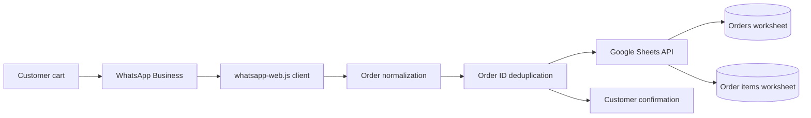

# WhatsApp Orders to Google Sheets

Event-driven Node.js service that captures shopping-cart orders from a
WhatsApp Business catalog and writes normalized order data to Google Sheets.

This project demonstrates API integration, service-account authentication,
idempotent data ingestion, retry handling, secret management, and automated
testing for a small-business order workflow.

> [!IMPORTANT]
> This proof of concept uses `whatsapp-web.js`, an unofficial WhatsApp Web
> client. It is not endorsed by Meta and may be affected by account
> restrictions or WhatsApp Web changes. The official WhatsApp Business
> Platform is the recommended production path.

## Architecture



The service listens only for WhatsApp messages of type `order`. Each accepted
cart is transformed into a summary record and one record per product. Google
Sheets writes are serialized to prevent concurrent orders from selecting the
same rows.

## Engineering Highlights

- Google Cloud service-account authentication with spreadsheet-scoped access.
- Automatic provisioning of `Orders` and `Order Items` worksheets and headers.
- Idempotency using the WhatsApp order ID.
- In-process write queue for concurrent order events.
- Atomic multi-range update for the order summary and its line items.
- Retry strategy for delayed WhatsApp order details.
- Persistent WhatsApp session through `LocalAuth`.
- QR and phone-number pairing modes.
- Customer confirmation only after a successful Sheets write.
- Node.js native test suite and GitHub Actions CI.
- Secrets, authentication state, QR images, and runtime logs excluded from Git.

## Technology

| Area | Technology |
| --- | --- |
| Runtime | Node.js 18+ |
| Messaging | `whatsapp-web.js` |
| Cloud API | Google Sheets API |
| Identity | Google Cloud service account |
| Browser automation | Puppeteer / Chromium |
| Testing | Node.js test runner |
| CI | GitHub Actions |

## Data Model

The service creates two worksheets:

**Orders**

| Received at | Order ID | Phone | Customer | Currency | Subtotal | Total | Status |
| --- | --- | --- | --- | --- | --- | --- | --- |

**Order Items**

| Received at | Order ID | Product ID | Product | Quantity | Unit price | Currency | Line total |
| --- | --- | --- | --- | --- | --- | --- | --- |

## Local Setup

### Prerequisites

- Node.js 18 or newer.
- A WhatsApp Business catalog.
- A Google spreadsheet.
- A Google Cloud project with Google Sheets API enabled.
- A Google Cloud service account and JSON key.

### Google Cloud

1. Enable Google Sheets API in a Google Cloud project.
2. Create a service account.
3. Create a JSON key for local development.
4. Share the target spreadsheet with the service account's `client_email` as
   an editor.
5. Store the key outside version control:

```text
.secrets/google-service-account.json
```

Never commit, paste, or distribute the JSON key.

### Application

```powershell
npm.cmd install
Copy-Item .env.example .env
```

Configure `.env`:

```dotenv
GOOGLE_SPREADSHEET_ID=your_spreadsheet_id
GOOGLE_SERVICE_ACCOUNT_FILE=.secrets/google-service-account.json
GOOGLE_ORDERS_SHEET=Orders
GOOGLE_ITEMS_SHEET=Order Items
SEND_CUSTOMER_CONFIRMATION=true
WHATSAPP_AUTH_PATH=.wwebjs_auth
WHATSAPP_PHONE_NUMBER=
```

Start the service:

```powershell
npm.cmd start
```

Without `WHATSAPP_PHONE_NUMBER`, the service generates
`whatsapp-qr.png`. When a phone number is configured in international,
digits-only format, the process displays an eight-character pairing code.

## Testing

```powershell
npm.cmd test
```

The tests cover cart normalization, spreadsheet row shape, calculated line
totals, and rejection of empty carts.

## Security

- `.env`, `.secrets/`, WhatsApp authentication state, QR images, and logs are
  excluded by `.gitignore`.
- The service account should receive access only to the target spreadsheet.
- The JSON key should be replaced with workload identity or a managed secret
  when deployed to a cloud environment.
- Customer phone numbers and order details are operational data and require
  appropriate retention and access controls.
- The service never trusts a client-provided calculated total as a payment
  authorization.

## Operations

The service requires continuous network access and persistent storage for
`.wwebjs_auth`. A production-like deployment should include:

- A process supervisor or Windows service with automatic restart.
- Persistent encrypted storage for the WhatsApp session.
- Managed secrets instead of a local JSON key.
- Structured logs, health checks, alerts, and dead-letter handling.
- Periodic dependency and account-link validation.
- A documented migration path to the official WhatsApp Cloud API.

## Current Limitations

- WhatsApp account linking must work before order events can be tested.
- `whatsapp-web.js` depends on private WhatsApp Web behavior.
- In-memory serialization assumes one running service instance.
- Google Sheets is suitable for this workload size, not high-volume
  transactional processing.
- Delivery details and payment confirmation are not yet part of the cart
  ingestion workflow.

## Roadmap

- Migrate messaging to the official WhatsApp Business Platform.
- Add delivery or pickup capture with WhatsApp Flows.
- Add PostgreSQL as the system of record and keep Sheets as an operational
  report.
- Package the process as a Windows service.
- Add health endpoints, metrics, alerting, and infrastructure as code.

## License

MIT
