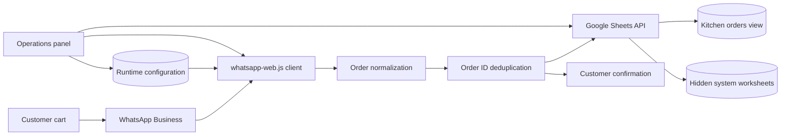

# WhatsApp Orders to Google Sheets

Event-driven Node.js service that captures shopping-cart orders from a
WhatsApp Business catalog and writes normalized order data to Google Sheets.

This project demonstrates API integration, service-account authentication,
idempotent data ingestion, retry handling, secret management, and automated
testing for a small-business order workflow.

> [!IMPORTANT]
> This proof of concept uses `whatsapp-web.js`, an unofficial WhatsApp Web
> client. It is not endorsed by Meta and may be affected by account
> restrictions or WhatsApp Web changes. The official WhatsApp Business
> Platform is the recommended production path.

## Architecture



The service accepts WhatsApp catalog carts and, on the conversational branch,
text-based orders. Each accepted order is transformed into a summary record
and one record per product. Google Sheets writes are serialized to prevent
concurrent orders from selecting the same rows.

The `feature/conversational-order-flow` branch also accepts text orders through
a persistent WhatsApp conversation. It collects quantities, validates the
minimum order, asks for the delivery day and fulfillment method, shows the
final total, and writes to Sheets only after the customer replies `SI`.

## Engineering Highlights

- Google Cloud service-account authentication with spreadsheet-scoped access.
- Automatic provisioning of a kitchen-friendly worksheet and internal records.
- Idempotency using the WhatsApp order ID.
- In-process write queue for concurrent order events.
- Atomic multi-range update for the order summary and its line items.
- Retry strategy for delayed WhatsApp order details.
- Persistent WhatsApp session through `LocalAuth`.
- QR and phone-number pairing modes.
- Natural-language pickup and delivery capture from customer replies.
- Brampton and Mississauga delivery fee calculation.
- Allowlist safety control that disables automation for every unapproved chat.
- Fulfillment selection derived from catalog items.
- A single visible worksheet with one row per order and product columns.
- Technical worksheets hidden automatically without deleting source data.
- Safe LID-to-phone resolution for current WhatsApp contact identifiers.
- Customer confirmation only after a successful Sheets write.
- Local operations panel for catalog, schedules, closures, and rescheduling.
- Runtime configuration shared by the web panel and WhatsApp messages.
- Node.js native test suite and GitHub Actions CI.
- Secrets, authentication state, QR images, and runtime logs excluded from Git.

## Technology

| Area | Technology |
| --- | --- |
| Runtime | Node.js 18+ |
| Messaging | `whatsapp-web.js` |
| Cloud API | Google Sheets API |
| Admin API | Express |
| Admin UI | HTML, CSS, JavaScript, Lucide |
| Identity | Google Cloud service account |
| Browser automation | Puppeteer / Chromium |
| Testing | Node.js test runner |
| CI | GitHub Actions |

## Data Model

The only visible worksheet is `Pedidos para cocina`. It uses one row per order
and creates one quantity column per catalog product:

| Order ID | Status | Date and time | Customer | Phone | Delivery or pickup | Address | Notes | Chocolate concha | Vanilla concha | Bolillo |
| --- | --- | --- | --- | --- | --- | --- | --- | --- | --- | --- |

The second row shows the total quantity to prepare for each product. New
products automatically become new columns. Delivery catalog items are used to
fill the delivery-or-pickup column and are not counted as food. Technical order
and item records remain in hidden worksheets for deduplication and future
automation.

The `Status` column has three options:

- `Confirmado`: its product quantities are included in `TOTAL A PREPARAR`.
- `Entregado`: it is excluded from totals, displayed in gray, and moved below
  active orders by the background synchronization process.
- `Cancelado`: it remains as inactive history and is excluded from totals.

## Local Setup

### Prerequisites

- Node.js 18 or newer.
- A WhatsApp Business catalog.
- A Google spreadsheet.
- A Google Cloud project with Google Sheets API enabled.
- A Google Cloud service account and JSON key.

### Google Cloud

1. Enable Google Sheets API in a Google Cloud project.
2. Create a service account.
3. Create a JSON key for local development.
4. Share the target spreadsheet with the service account's `client_email` as
   an editor.
5. Store the key outside version control:

```text
.secrets/google-service-account.json
```

Never commit, paste, or distribute the JSON key.

### Application

```powershell
npm.cmd install
Copy-Item .env.example .env
```

Configure `.env`:

```dotenv
GOOGLE_SPREADSHEET_ID=your_spreadsheet_id
GOOGLE_SERVICE_ACCOUNT_FILE=.secrets/google-service-account.json
GOOGLE_ORDERS_SHEET=Orders
GOOGLE_ITEMS_SHEET=Order Items
GOOGLE_PRODUCTION_SHEET=Production
GOOGLE_KITCHEN_SHEET=Kitchen Orders
SEND_CUSTOMER_CONFIRMATION=true
WHATSAPP_AUTH_PATH=.wwebjs_auth
WHATSAPP_PHONE_NUMBER=
WHATSAPP_PRICE_DIVISOR=1000
BRAMPTON_DELIVERY_FEE=5
MISSISSAUGA_DELIVERY_FEE=8
PICKUP_TIME_WINDOW=5:00 p.m. a 6:00 p.m.
WHATSAPP_AUTOMATION_ALLOWLIST=
WHATSAPP_AUTOMATION_ALLOWED_PHONES=
AUTO_REPLY_COOLDOWN_HOURS=24
AUTO_REPLY_STATE_FILE=.data/auto-reply-state.json
CONVERSATION_STATE_FILE=.data/conversation-state.json
MINIMUM_ORDER_PIECES=5
CHOCOLATE_CONCHA_PRICE=3.50
VANILLA_CONCHA_PRICE=3.50
BOLILLO_PRICE=2.50
WEDNESDAY_DELIVERY_WINDOW=después de las 3:00 PM
SATURDAY_DELIVERY_WINDOW=después de las 10:00 AM
```

Start the service:

```powershell
npm.cmd start
```

Without `WHATSAPP_PHONE_NUMBER`, the service generates
`whatsapp-qr.png`. When a phone number is configured in international,
digits-only format, the process displays an eight-character pairing code.

### Safe test mode

The panel starts in `Testing` mode. Approved phone numbers can be seeded
without symbols through the environment:

```dotenv
WHATSAPP_AUTOMATION_ALLOWED_PHONES=14165550123,16475550123
```

The `Control del bot` view is then the source of truth:

- `Solo pruebas` responds only to numbers in the allowed list.
- `Producción` responds to every customer except numbers in the blocked list.
- Blocked numbers never receive automated replies in either mode.

The panel always shows the currently active mode separately from an unsaved
selection. Switching to production requires `Guardar y aplicar` and an
explicit confirmation.

### Conversational order flow

Any text from an allowed test chat starts the menu. The conversation proceeds
through:

1. Product preference using the active web-panel catalog.
2. Quantity for every available product.
3. Minimum-piece validation.
4. One of the currently available service dates.
5. Free pickup or paid delivery.
6. Brampton or Mississauga when delivery is selected.
7. A written delivery address, Google Maps link, or WhatsApp location.
8. Final `SI` or `NO` confirmation.

Incomplete conversations are not written to Google Sheets. Canceled confirmed
orders remain only as inactive history. Delivery orders require an address
before final confirmation. Conversation progress is stored in
`.data/conversation-state.json`, which is excluded from Git.

WhatsApp catalog carts use the same confirmation rules. After receiving a
cart, the bot:

1. Shows the detected products and quantities.
2. Asks whether the customer wants free pickup or delivery.
3. Requests the city and address only for delivery.
4. Offers the currently available schedule for that service.
5. Shows the final total and requires `SI`.

The cart is not added to Google Sheets or production totals until that final
confirmation. Native WhatsApp locations and Google Maps links are supported.

Delivery addresses are shown in the final confirmation and in the visible
`Direccion` worksheet column. Google Maps links are stored without rewriting
the URL. A native WhatsApp location uses its description when available or a
Maps coordinates link otherwise.

After confirmation, customers can write `ACTUALIZAR PEDIDO` or use natural
words such as `agregar`, `quitar`, `cambiar`, or `cancelar`. The bot reminds
them of the current order and offers these actions for both catalog carts and
orders captured through chat:

- Add or remove a product quantity.
- Change the delivery day.
- Switch between free pickup and delivery.
- Cancel the complete order with a second confirmation.

Changes replace the existing order under the same ID only after `SI`.
Canceled orders remain in the worksheet for history, are excluded from
production totals, and appear as inactive rows.

### Operations panel

The bot serves a local operations interface with the same process:

```text
http://127.0.0.1:3090
```

The panel supports:

- Up to ten catalog products with editable names, kitchen labels, prices,
  icons, and availability.
- Weekly pickup and delivery availability with independent time windows.
- Compact date availability and date-specific exceptions.
- Affected-order review with the next immediate available date.
- Testing and normal automation modes with allowed and blocked phone lists.
- A policy-protected `Notify and reschedule` action that sends the WhatsApp
  notice and updates Google Sheets and conversation state.

Runtime changes are stored in `.data/admin-config.json`, which is excluded
from Git. New WhatsApp messages read this configuration immediately. The
default host is loopback-only; set `ADMIN_PASSWORD` before changing
`ADMIN_HOST` to expose the panel on another interface.

### Catalog fulfillment items

Customers may send a cart containing only food products. The bot always asks
whether they want pickup or delivery after receiving it, so catalog logistics
items are no longer required.

For backward compatibility, existing items such as:

- `Delivery in Mississauga`
- `Delivery in Brampton`
- `Recoger`

are still recognized and excluded from kitchen quantities. The customer's
answer in the follow-up flow determines the final service and fee.

`PICKUP_TIME_WINDOW` controls the pickup window included in the automatic
customer reply and in the kitchen worksheet notes.

## Testing

```powershell
npm.cmd test
```

The tests cover cart normalization, WhatsApp monetary units, spreadsheet row
shape, the simplified kitchen view, pickup and delivery classification, and
city fees.

## Security

- `.env`, `.secrets/`, WhatsApp authentication state, QR images, and logs are
  excluded by `.gitignore`.
- The service account should receive access only to the target spreadsheet.
- The JSON key should be replaced with workload identity or a managed secret
  when deployed to a cloud environment.
- Customer phone numbers and order details are operational data and require
  appropriate retention and access controls.
- The operations panel binds to `127.0.0.1` by default. Remote exposure
  requires authentication, TLS, and network access controls.
- The service never trusts a client-provided calculated total as a payment
  authorization.

## Operations

The service requires continuous network access and persistent storage for
`.wwebjs_auth`. A production-like deployment should include:

- A process supervisor or Windows service with automatic restart.
- Persistent encrypted storage for the WhatsApp session.
- Managed secrets instead of a local JSON key.
- Structured logs, health checks, alerts, and dead-letter handling.
- Periodic dependency and account-link validation.
- A documented migration path to the official WhatsApp Cloud API.

## Current Limitations

- WhatsApp account linking must work before order events can be tested.
- `whatsapp-web.js` depends on private WhatsApp Web behavior.
- In-memory serialization assumes one running service instance.
- Google Sheets is suitable for this workload size, not high-volume
  transactional processing.
- Address-to-city reverse geocoding is not yet automatic when a shared
  location has coordinates but no address text.
- Payment confirmation is not yet part of the workflow.

## Roadmap

- Migrate messaging to the official WhatsApp Business Platform.
- Add delivery or pickup capture with WhatsApp Flows.
- Add PostgreSQL as the system of record and keep Sheets as an operational
  report.
- Package the process as a Windows service.
- Add health endpoints, metrics, alerting, and infrastructure as code.

## License

MIT
